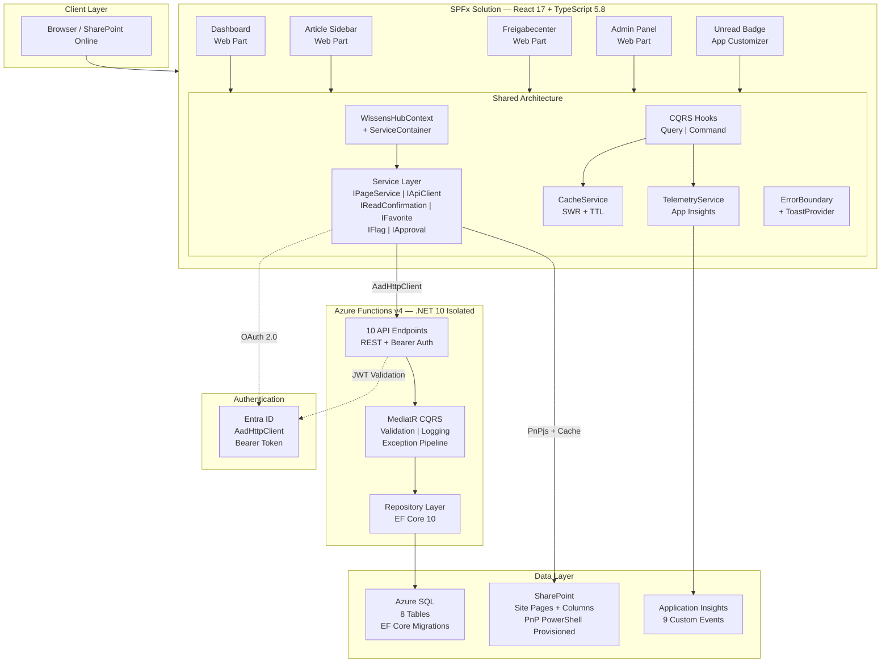

# WissensHub

**Internal Knowledge Management Hub for Microsoft 365**

>A full-stack SharePoint Framework solution with Azure Functions API, Azure SQL tracking, and GitHub Actions CI/CD.


## Problem

Organizations with mandatory knowledge articles rely on emails, shared drives, and manual tracking to ensure employees read critical content. This leads to:

- **No read accountability** — no way to verify who read what
- **Outdated content** — stale articles circulate without review cycles
- **Manual compliance reporting** — HR and compliance teams build reports by hand
- **Scattered information** — knowledge lives across SharePoint, Teams, email, and file shares

## Solution

WissensHub is a SharePoint Framework solution that turns SharePoint Communication Sites into a structured knowledge management hub. Articles are authored as native SharePoint pages — WissensHub adds read tracking, approval workflows, freshness monitoring, and compliance reporting on top.

Employees browse articles from a central dashboard, confirm reads, and receive reminders for mandatory content. Reviewers manage approval workflows. Admins configure categories, target groups, and generate read confirmation reports.

## Key Features

- **Dashboard with search & filters** — card/list views, category and target group filtering, full-text search
- **Read confirmation tracking** — per-article read status saved to Azure SQL, auto-reset on major updates
- **Approval workflow** — Draft → InReview → Published → Archived with audit trail
- **Freigabecenter** — reviewer hub for pending approvals, flagged content, and freshness alerts
- **Unread badge** — site-wide header notification with flyout panel
- **Admin panel** — category/target group config, read reports with CSV/Excel export
- **Caching & telemetry** — PnPjs session cache, stale-while-revalidate hooks, Application Insights
- **i18n** — German (default) and English, fully localized UI

## Architecture



## Tech Stack

| Layer | Technology |
|-------|-----------|
| **Frontend** | SPFx 1.22.2, React 17, TypeScript 5.8, Fluent UI 8, PnPjs 4.18 |
| **Backend** | .NET 10, Azure Functions v4 (Isolated Worker), MediatR, FluentValidation |
| **Data** | Azure SQL (EF Core 10 code-first), SharePoint Site Pages |
| **Auth** | Entra ID, AadHttpClient, Bearer Token (JWT) |
| **Caching** | PnPjs session cache (5 min), in-memory SWR with TTL |
| **Telemetry** | Application Insights (9 custom events), Error Boundaries, Toast notifications |
| **i18n** | SPFx localization framework (German default, English) |
| **Toolchain** | Heft (no Gulp), ESLint, Jest, Docker Compose |
| **DevOps** | GitHub Actions, Azure Bicep, PnP PowerShell |

## Project Scope

**12 development phases** producing **342 source files** across **15,600+ lines** of TypeScript, SCSS, and C#.

| Phase | Description | Status |
|-------|-------------|--------|
| 1. Project Scaffolding | SPFx + Azure Functions + Docker + EF Core schema | :white_check_mark: Complete |
| 2. SharePoint Site & Auth | Provisioning, Entra ID, AadHttpClient | :white_check_mark: Complete |
| 3. Frontend Architecture | Context, services, Result pattern, role detection | :white_check_mark: Complete |
| 4. Backend Architecture | MediatR CQRS, repositories, API endpoints, JWT auth | :white_check_mark: Complete |
| 5. Dashboard Web Part | Card/list views, search, filters, stats bar | :white_check_mark: Complete |
| 6. Article Sidebar | Metadata, read confirmations, flags, favorites, TOC | :white_check_mark: Complete |
| 7. Freigabecenter | Approval workflow, flagged articles, freshness alerts | :white_check_mark: Complete |
| 8. Unread Badge | Header notification icon, flyout panel | :white_check_mark: Complete |
| 9. Admin Panel | Categories, target groups, reports, CSV/Excel export | :white_check_mark: Complete |
| 10. Caching & Telemetry | SWR caching, App Insights, error boundaries, i18n | :white_check_mark: Complete |
| 11. Testing | Jest unit, .NET integration, Playwright E2E | :white_check_mark: Complete |
| 12. DevOps & Deployment | Azure Bicep, GitHub Actions CI/CD, OIDC | :white_check_mark: Complete |

## Screenshots

> Screenshots will be added as development progresses.

## Local Development

### Prerequisites

- [Node.js 22 LTS](https://nodejs.org/)
- [.NET 10 SDK](https://dotnet.microsoft.com/)
- [Docker Desktop](https://www.docker.com/products/docker-desktop/)
- [Azure Functions Core Tools v4](https://learn.microsoft.com/azure/azure-functions/functions-run-local)
- [PnP PowerShell](https://pnp.github.io/powershell/) (for SharePoint provisioning)
- A Microsoft 365 developer tenant

### Local Development

1. **Clone the repository**
   ```bash
   git clone https://github.com/suroweb/wissens-hub.git
   cd wissens-hub
   ```

2. **Start the database**
   ```bash
   npm run db:up
   ```

3. **Apply EF Core migrations**
   ```bash
   npm run db:migrate
   ```

4. **Configure the API**
   ```bash
   cp scripts/config.template.json scripts/config.json
   # Edit scripts/config.json with your tenant details
   ```

5. **Start the Azure Functions API**
   ```bash
   npm run api:start
   ```

6. **Install SPFx dependencies and serve**
   ```bash
   cd spfx && npm install && npm start
   ```

7. **Open the workbench**
   ```
   https://<your-tenant>.sharepoint.com/_layouts/15/workbench.aspx
   ```

8. **Run everything at once** (after initial setup)
   ```bash
   npm run dev
   ```

### SharePoint Provisioning

Provision the site, groups, columns, sample pages, and navigation:

```powershell
cd scripts
./Deploy-WissensHub.ps1 -SiteUrl "https://<tenant>.sharepoint.com/sites/WissensHub"
```

## API Endpoints

| Method | Endpoint | Description |
|--------|----------|-------------|
| `GET` | `/api/articles/{pageId}/status` | Article metadata + read status |
| `GET` | `/api/articles/unread` | Unread articles for current user |
| `POST` | `/api/articles/{pageId}/read` | Mark article as read |
| `POST` | `/api/articles/{pageId}/flag` | Flag article as outdated |
| `GET` | `/api/articles/{pageId}/readstats` | Read confirmation stats (reviewer/admin) |
| `GET` | `/api/articles/{pageId}/history` | Approval history for article |
| `GET` | `/api/articles/flagged` | All flagged articles |
| `POST` | `/api/articles/{pageId}/approve` | Approve or reject article |
| `GET` | `/api/favorites` | User's favorite articles |
| `POST` | `/api/favorites/{pageId}` | Toggle favorite |
| `GET` | `/api/dashboard/stats` | Dashboard statistics |
| `GET` | `/api/management/reports` | Read confirmation reports |
| `GET` | `/api/management/reports/{pageId}` | Detailed read stats per article |
| `GET` | `/api/config/categories` | All categories |
| `POST` | `/api/config/categories` | Create category |
| `PUT` | `/api/config/categories/{id}` | Update category |
| `DELETE` | `/api/config/categories/{id}` | Delete category |
| `GET` | `/api/config/target-groups` | All target groups |
| `POST` | `/api/config/target-groups` | Create target group |
| `PUT` | `/api/config/target-groups/{id}` | Update target group |
| `DELETE` | `/api/config/target-groups/{id}` | Delete target group |
| `GET` | `/api/config/reminder-interval` | Get reminder interval |
| `PUT` | `/api/config/reminder-interval` | Update reminder interval |
| `GET` | `/api/health` | Health check |

### Example Requests

```bash
# Get dashboard statistics
curl -H "Authorization: Bearer <token>" \
  https://wh-prod-func.azurewebsites.net/api/dashboard/stats

# Mark an article as read
curl -X POST -H "Authorization: Bearer <token>" \
  -H "Content-Type: application/json" \
  https://wh-prod-func.azurewebsites.net/api/articles/42/read

# Get unread articles for current user
curl -H "Authorization: Bearer <token>" \
  https://wh-prod-func.azurewebsites.net/api/articles/unread
```

## Production Deployment

### Prerequisites

- Azure subscription with a resource group
- GitHub repository with Actions enabled
- Microsoft 365 tenant with SharePoint app catalog
- Two Entra ID app registrations (Azure deployment + M365 CI/CD) with OIDC federated credentials

### Infrastructure Provisioning

Azure resources are defined as Bicep modules under `infra/`. Deploy manually for first-time setup:

```bash
az login
az deployment group create \
  --resource-group <your-resource-group> \
  --template-file infra/main.bicep \
  --parameters infra/parameters/prod.bicepparam \
  --parameters sqlAdminPassword=<your-secure-password>
```

This provisions: Azure Functions (Linux Consumption), Azure SQL (Basic tier), Application Insights, Key Vault, and Storage Account. All resources are prefixed with `wh-prod-`.

### CI/CD Pipeline

Two GitHub Actions workflows automate quality and deployment:

| Workflow | Trigger | What it does |
|----------|---------|--------------|
| CI (`ci.yml`) | Pull request to main | Builds + tests SPFx and API. Failures block merge. |
| CD (`cd.yml`) | Push to main | Builds, tests, deploys infrastructure (Bicep), runs database migrations (EF Core bundle), deploys Azure Functions, deploys SPFx to tenant app catalog. |

Authentication uses OIDC federated identity -- no client secrets stored in the repository.

### GitHub Configuration

**Variables** (Settings > Secrets and variables > Actions > Variables):

| Variable | Value |
|----------|-------|
| `AZURE_CLIENT_ID` | Azure deployment app registration client ID |
| `AZURE_TENANT_ID` | Entra ID tenant ID |
| `AZURE_SUBSCRIPTION_ID` | Azure subscription ID |
| `AZURE_RESOURCE_GROUP` | Target resource group name |
| `AZURE_FUNCTION_APP_NAME` | `wh-prod-func` |
| `M365_CLIENT_ID` | M365 CI/CD app registration client ID |
| `SPO_APP_CATALOG_URL` | SharePoint app catalog URL |

**Secrets** (Settings > Secrets and variables > Actions > Secrets):

| Secret | Value |
|--------|-------|
| `SQL_ADMIN_PASSWORD` | Azure SQL admin password |
| `SQL_CONNECTION_STRING` | Full ADO.NET connection string for Azure SQL |

### OIDC Federated Identity Setup

Two Entra ID app registrations are needed -- one for Azure resource deployment, one for M365/SharePoint operations. Each requires a federated credential configured for the `main` branch subject claim (`repo:<owner>/<repo>:ref:refs/heads/main`).

For detailed setup instructions, see the [GitHub OIDC documentation for Azure](https://docs.github.com/actions/deployment/security-hardening-your-deployments/configuring-openid-connect-in-azure).

## Project Structure

```
wissens-hub/
├── spfx/                          # SharePoint Framework solution
│   └── src/
│       ├── webparts/
│       │   ├── dashboard/         # Dashboard Web Part
│       │   ├── articleSidebar/    # Article Sidebar Web Part
│       │   ├── freigabecenter/    # Freigabecenter Web Part
│       │   └── adminPanel/        # Admin Panel Web Part
│       ├── extensions/
│       │   └── unreadBadge/       # Unread Badge Application Customizer
│       └── shared/                # Shared architecture
│           ├── context/           # WissensHubContext, ServiceContainer
│           ├── services/          # Production + mock service implementations
│           ├── hooks/             # CQRS query and command hooks
│           ├── components/        # ErrorBoundary, ToastProvider, Shimmer
│           ├── models/            # Domain models and DTOs
│           └── loc/               # Shared localization strings
├── api/                           # Azure Functions backend
│   └── src/
│       ├── WissensHub.Functions/  # Azure Function endpoints
│       ├── WissensHub.Application/# MediatR handlers, validators, DTOs
│       ├── WissensHub.Domain/     # Entities, interfaces
│       └── WissensHub.Infrastructure/ # EF Core, repository implementations
├── infra/                         # Azure Bicep infrastructure as code
│   ├── main.bicep                 # Orchestrator module
│   ├── modules/                   # Resource modules (SQL, Functions, etc.)
│   └── parameters/                # Environment parameter files
├── .github/workflows/             # GitHub Actions CI/CD
│   ├── ci.yml                     # PR validation (build + test)
│   └── cd.yml                     # Deploy on merge to main
├── e2e/                           # Playwright E2E tests
├── docker/                        # Docker Compose (SQL Server 2022)
└── scripts/                       # PnP PowerShell provisioning
```

## Testing

| Suite | Command | Coverage |
|-------|---------|----------|
| Frontend unit tests | `npm run test:frontend` | 161 tests (services, hooks, components) |
| Backend integration tests | `npm run test:backend` | 49 tests (API endpoints against SQL Server) |
| E2E tests | `npm run test:e2e` | 4 Playwright specs (dashboard, read, approve, admin) |
| All tests | `npm run test:all` | Frontend + backend |

## License

[MIT](LICENSE)
